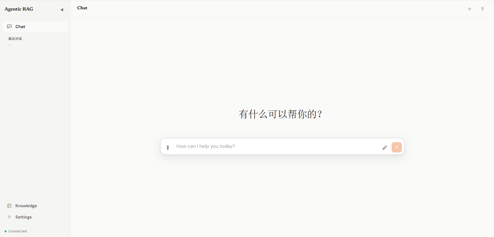
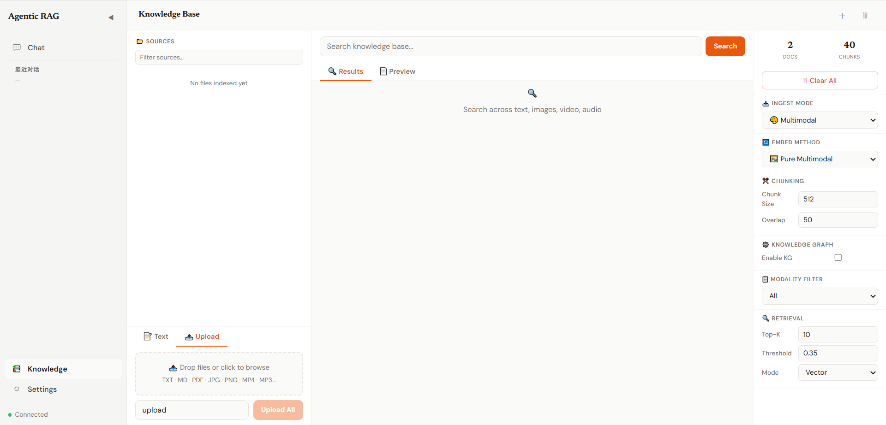
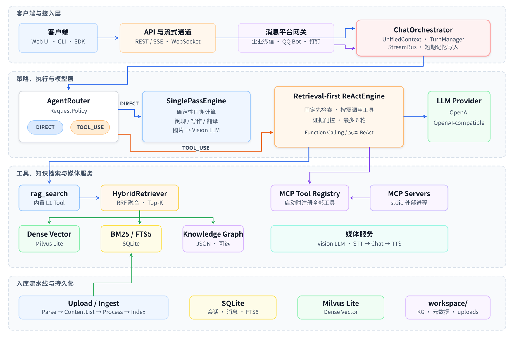
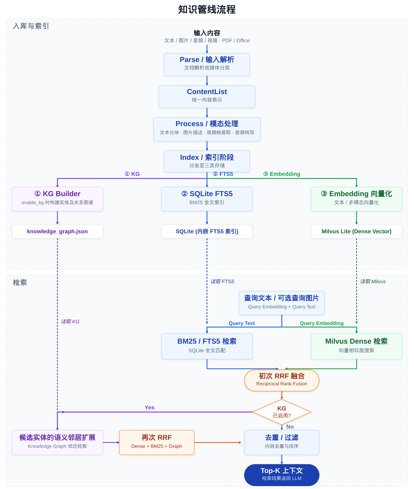

# Agentic RAG 智能问答系统

<p align="center"><b>ReAct Agent 驱动</b> | <b>多模态知识库</b> | <b>MCP 工具扩展</b> | <b>边缘/本地部署</b></p>

---

基于 **ReAct Agent** 的多模态检索增强生成（RAG）系统，支持文本、图片、音频、视频的统一入库与跨模态检索，提供智能问答、工具调用、MCP 扩展、流式对话、语音交互等完整能力。支持 OpenAI / 本地 OpenAI-compatible 模型，可灵活部署在云端或边缘设备上。

[](https://www.python.org/downloads/)
[](https://fastapi.tiangolo.com/)
[](https://react.dev/)
[](https://milvus.io/)
[](LICENSE)

> 当前版本：`0.1.0`。部分能力还需要进一步开发验证。
>
---





---

## 目录

- [项目背景](#项目背景)
- [核心特性](#核心特性)
- [系统架构](#系统架构)
- [快速开始](#快速开始)
- [使用方式](#使用方式)
- [其他功能](#其他功能)
  - [多模态知识库](#多模态知识库)
  - [MCP 工具扩展](#mcp-工具扩展)
  - [语音与消息网关](#语音与消息网关)
  - [功能状态](#功能状态)
- [AX8850 运行示例](#ax8850-运行示例)


---

## 项目背景

### 为什么需要 Agentic RAG？

传统 RAG 系统只能被动检索，而现实场景中的问题往往需要多步推理、工具调用和动态决策：

- **静态检索局限** — 一次性检索难以回答需要多轮推理的复杂问题。
- **模态割裂** — 文本、图片、音视频分散存储，无法统一检索，大量非文本信息被浪费。
- **工具孤岛** — 检索、计算、外部 API 等能力各自独立，Agent 无法根据上下文自主选择工具。
- **部署复杂** — 多数方案依赖云端服务，存在隐私泄露风险和高昂调用成本。

### 本项目的解决思路

本项目采用**最小执行路径优先**：日期计算、闲聊、改写和多模态图片问答进入直接回答路径；其余需要事实依据的问题进入检索优先的 ReAct 路径，固定先查本地知识库，再由模型按需调用已连接的 MCP 工具：

- 🧠 **策略驱动执行** — 程序先选择最小可靠路径，复杂任务再交给 Agent 进行多轮推理和工具链调用。
- 🔗 **MCP 生态接入** — 通过 Model Context Protocol 接入外部工具，Agent 能力可无限扩展。
- 🎨 **多模态统一** — 文本、图片、音频、视频统一向量空间，跨模态语义检索。
- 🏠 **本地优先** — 支持本地 LLM / Embedding 服务，数据不出设备，隐私安全可控。

### 应用场景

| 领域 | 典型场景 | 核心价值 |
|------|----------|----------|
| 🏢 **企业知识管理** | 智能客服、内部培训、文档问答 | 多轮对话理解上下文，自动调用内部工具查询数据 |
| 🔬 **研发辅助** | 代码库问答、技术文档检索、API 集成 | Agent 自主检索代码示例、调用调试工具、生成修复建议 |
| 📚 **教育科研** | 文献综述、课件问答、实验数据分析 | 跨文献多轮推理，自动提取关键信息并生成综述 |
| 🎬 **内容创作** | 素材检索、脚本生成、多模态内容理解 | 以文搜图/以图搜视频，Agent 辅助创作全流程 |
| 🏥 **专业领域** | 医疗文献问答、法律条文检索、金融报告分析 | 严格的数据隐私要求下本地运行，专业工具链集成 |

---

## 核心特性

### 🚀 功能特性

- **双路径执行引擎** — `RequestPolicy` 在直接回答与检索优先 ReAct 之间选择；事实型问题先查知识库，再按需调用 MCP 工具。
- **统一聊天入口** — 对外只有一个 Chat API，内部根据请求证据需求选择最小执行路径。
- **四模态统一检索** — 文本、图片、音频、视频在同一向量空间中表示，支持以文搜图、以图搜视频等跨模态查询。
- **混合检索策略** — 支持 `naive` 纯向量检索，以及 `hybrid` 向量 + BM25 全文召回 + RRF 融合；启用知识图谱时再加入图检索结果。
- **流式对话体验** — REST SSE 与 WebSocket 双通道流式输出，实时展示 Agent 思考过程和工具调用。
- **多入口灵活接入** — Web UI、REST API、WebSocket、CLI、异步 Python SDK，满足不同场景需求。

### 🔧 技术特性

- **MCP 工具扩展** — 启动时自动连接外部 MCP Server，将工具注册到 Agent，实现能力热插拔。
- **多提供商 LLM** — 内置 OpenAI、Claude，以及任意 OpenAI-compatible 本地服务适配。
- **模块化架构** — Agent 引擎、知识管线、向量存储、LLM 服务、记忆系统分层解耦，可独立替换升级。
- **本地数据持久化** — SQLite 会话与 FTS5 全文索引、Milvus Lite 向量库、JSON 知识图谱，零外部服务即可运行。
- **可配置预处理** — 文本分块大小、图片处理策略、音频切片参数等均可通过环境变量调节。

---

## 系统架构

### 整体架构



系统以 `ChatOrchestrator` 为统一编排入口。REST、WebSocket、CLI、SDK 和消息平台网关最终都复用同一运行时；`UnifiedContext` 携带会话与服务引用，`TurnManager` 记录轮次和用量，`StreamBus` 发布流式事件。

`AgentRouter` 根据 `RequestPolicy` 只选择两类执行路径：

- **DIRECT → `SinglePassEngine`**：本地日期计算直接返回确定结果；闲聊、写作、翻译等由 LLM 单次生成；带图片的请求由支持视觉能力的 LLM 直接处理。
- **TOOL_USE → `ReActEngine`**：知识问答、时效问题和明确的研究任务都进入该路径。引擎在第一次 LLM 调用前固定执行 `rag_search`，随后把 `rag_search` 与全部已注册 MCP 工具交给模型，支持原生 Function Calling 或文本 ReAct，最多迭代 6 轮。

工具路径启用了**证据门控**：只有 `rag_search` 或 MCP 工具返回可用结果后才允许形成事实型答案；本地知识库没有相关内容但存在 MCP 工具时，模型可继续选择合适的 MCP 工具。所有证据源均不可用时，系统返回明确的可靠性失败说明，不使用模型记忆猜测。


### 知识管线流程




### 项目结构

```text
Agentic_RAG/
├── agentic_rag/                 # 后端核心代码
│   ├── agent/                   # DIRECT/TOOL_USE 策略、SinglePass、ReAct 与路由
│   ├── config/                  # Pydantic Settings、默认配置
│   ├── core/                    # MCP 客户端、多模态处理、STT/TTS
│   ├── data/                    # 数据模型、SQLite Repository
│   ├── entrypoints/             # 接入层
│   │   ├── rest/                # FastAPI REST API
│   │   ├── websocket/           # WebSocket 服务
│   │   ├── cli/                 # 命令行接口
│   │   ├── sdk/                 # Python SDK
│   │   └── gateway/             # 消息平台网关
│   ├── orchestration/           # L1 工具、L2 能力编排
│   ├── runtime/                 # 运行时上下文、流总线、轮次协调
│   ├── services/                # LLM、知识管线、记忆、会话、向量存储
│   └── utils/                   # 通用工具
├── frontend/                    # React 19 + Vite 8 前端
│   ├── src/
│   └── vite.config.js
├── static/                      # 前端构建产物（生产模式）
├── tests/                       # 文档解析、混合检索、对话与语音流程测试
├── docs/assets/readme/          # README 使用的固定图片资源目录
├── output/                      # 架构图与流程图的生成输出
├── data/                        # SQLite 运行时数据
├── workspace/                   # 上传文件、向量库、知识图谱
├── .env                         # 环境变量配置（由 .env.example 复制）
├── .env.example                 # 环境变量模板
├── mcp_servers.json             # MCP 配置（JSON）
├── mcp_servers.yaml             # MCP 配置（YAML）
├── pyproject.toml               # Python 项目配置
└── README.md
```

---

## 快速开始

### 1. 环境要求

- **Python** 3.10+
- **Node.js** 18+（构建 Web UI 需要；生产环境直接使用已构建的 `static/` 产物时可省略）


### 2. 安装

```bash
git clone <repository-url>
cd Agentic_RAG

python -m venv .venv
source .venv/bin/activate        # Linux/macOS
# .venv\Scripts\activate         # Windows PowerShell

python -m pip install --upgrade pip
pip install -e ".[dev]"

# 完整安装：Anthropic、语音、视频、文档解析和消息网关
# pip install -e ".[dev,anthropic,voice,media,documents,gateways]"

# 可选：PDF/Office 完整解析
pip install pymupdf              # PDF 文本提取及 OCR 页面渲染
# 或按 Docling 官方说明安装 docling
```


### 3. 配置环境变量

从模板创建 `.env` 文件：

```bash
cp .env.example .env
```

然后按需修改（配置使用**无前缀变量名**）：

```bash
# ============ LLM 配置 ============
DEFAULT_PROVIDER=local

LLM_PROVIDERS__LOCAL__API_BASE=http://localhost:8009/v1
LLM_PROVIDERS__LOCAL__MODEL=your-chat-model
LLM_PROVIDERS__LOCAL__API_KEY=not-needed
LLM_PROVIDERS__LOCAL__VISION_MODEL=your-vision-model

# ============ Embedding 配置 ============
EMBEDDING__PROVIDER=local
EMBEDDING__API_BASE=http://localhost:8010/v1
EMBEDDING__API_KEY=not-needed
EMBEDDING__MODEL=your-embedding-model
EMBEDDING__DIM=768
EMBEDDING__BATCH_SIZE=4

# ============ 向量库配置 ============
MILVUS__DIM=768

# ============ API 服务配置 ============
API__HOST=0.0.0.0
API__PORT=8007
```

> ⚠️ `EMBEDDING__DIM` 与 `MILVUS__DIM` 必须一致。若需修改已创建集合的维度，请先备份并删除旧的 `workspace/milvus_lite.db`，再重新建库。

**使用官方云服务：**

```bash
# OpenAI
DEFAULT_PROVIDER=openai
LLM_PROVIDERS__OPENAI__API_KEY=your-openai-api-key
LLM_PROVIDERS__OPENAI__API_BASE=https://api.openai.com/v1
LLM_PROVIDERS__OPENAI__MODEL=gpt-4o

# Anthropic Claude（Embedding 仍需单独配置）
DEFAULT_PROVIDER=claude
LLM_PROVIDERS__CLAUDE__API_KEY=your-anthropic-api-key
LLM_PROVIDERS__CLAUDE__API_BASE=https://api.anthropic.com
LLM_PROVIDERS__CLAUDE__MODEL=your-claude-model
```

### 4. 构建前端

```bash
cd frontend
npm run build
cd ..
```

Vite 产物输出到 `static/`，FastAPI 挂载 `/static` 并在 `/` 返回 SPA 首页。生产环境只需构建一次；前端源码未改动时无需重复执行。

### 5. 启动服务

```bash
# 生产模式
python -m agentic_rag serve --host 0.0.0.0 --port 8007

# 开发模式（自动重载）
python -m agentic_rag serve --port 8007 --reload
# 或
uvicorn agentic_rag.entrypoints.rest.app:app --host 0.0.0.0 --port 8007 --reload
```

### 6. 验证运行

```bash
curl http://localhost:8007/health
curl http://localhost:8007/ready
```

| 地址 | 说明 |
|------|------|
| `http://localhost:8007/` | Web UI 主界面 |
| `http://localhost:8007/docs` | Swagger API 文档 |
| `http://localhost:8007/health` | 进程健康检查 |
| `http://localhost:8007/ready` | LLM 配置就绪检查 |

✅ 打开 `http://localhost:8007/`，看到聊天界面即部署成功。若页面空白或报资源加载失败，通常是 `static/` 缺失或过期，请回到第 4 步重新执行 `npm run build`。

---

## 使用方式

系统提供多种使用入口：**Web UI** 是浏览器中的完整交互界面，适合直接使用；CLI / REST API / WebSocket / Python SDK 面向脚本调用与二次开发。

### Web UI

```bash
# 1. 构建前端（首次或前端有更新时执行）
cd frontend && npm install && npm run build && cd ..

# 2. 启动服务（后端托管 Web UI）
python -m agentic_rag serve --port 8007
```

启动后在浏览器打开 `http://localhost:8007/`：

- **对话交互** — 输入问题即开始问答，流式展示 Agent 的 Thought / Action / Observation 推理过程
- **文件上传** — 上传文本、图片、音频、视频入库，对应 `/api/v1/rag/upload`
- **会话管理** — 多会话切换，历史记录持久化在本地 SQLite


### CLI 命令行

```bash
# 普通问答
python -m agentic_rag chat "什么是 RAG？"

# 深入总结
python -m agentic_rag chat "深入总结知识库中的检索方法"

# 流式输出
python -m agentic_rag chat --stream "解释 ReAct 的执行过程"

# 指定已配置的 Provider
python -m agentic_rag chat --provider local "你好"

# 文本文件入库
python -m agentic_rag ingest --file document.txt --source cli

# 查看当前配置信息
python -m agentic_rag info

# 查看帮助
python -m agentic_rag --help
```

### REST API

#### 非流式聊天

```bash
curl -X POST http://localhost:8007/api/v1/chat \
  -H 'Content-Type: application/json' \
  -d '{"message":"什么是 RAG？"}'
```

#### SSE 流式聊天

```bash
curl -N -X POST http://localhost:8007/api/v1/chat/stream \
  -H 'Content-Type: application/json' \
  -d '{"message":"检索知识库中的向量数据库资料"}'
```

主要事件类型：`text_delta`、`tool_call_start`、`tool_call_result`、`error`、`done`。

#### 知识库检索

```bash
curl -X POST http://localhost:8007/api/v1/rag/search \
  -H 'Content-Type: application/json' \
  -d '{"query":"向量数据库","top_k":3,"mode":"hybrid"}'
```

#### 文本入库

```bash
curl -X POST http://localhost:8007/api/v1/rag/ingest \
  -H 'Content-Type: application/json' \
  -d '{"content":"Milvus 是一个向量数据库。","source":"manual"}'
```

#### 文件/多模态上传

```bash
curl -X POST http://localhost:8007/api/v1/rag/upload \
  -F 'file=@document.pdf' \
  -F 'source=manual-upload' \
  -F 'ingest_mode=multimodal' \
  -F 'mm_method=pure' \
  -F 'enable_kg=true'
```

支持的文件格式：
- **文本/文档**：`.txt` `.md` `.json` `.yaml` `.csv` `.py` `.html` `.pdf` `.docx` 
- **图片**：`.jpg` `.png` `.gif` `.webp` `.bmp` `.svg`
- **视频**：`.mp4` `.avi` `.mov` `.mkv` `.webm`
- **音频**：`.mp3` `.wav` `.m4a` `.ogg` `.flac`

#### 会话管理

```bash
# 创建会话（user_id 是查询参数）
curl -X POST 'http://localhost:8007/api/v1/session?user_id=user123'

# 获取会话列表
curl 'http://localhost:8007/api/v1/sessions?user_id=user123'

# 获取会话消息
curl http://localhost:8007/api/v1/session/<session_id>/messages

# 删除会话
curl -X DELETE http://localhost:8007/api/v1/session/<session_id>
```


### WebSocket

```javascript
const sessionId = crypto.randomUUID()
const ws = new WebSocket(`ws://localhost:8007/ws/${sessionId}`)

ws.addEventListener('open', () => {
  ws.send(JSON.stringify({
    type: 'chat',
    payload: {
      message: '检索知识库中的 ReAct 资料',
    },
  }))
})

ws.addEventListener('message', (event) => {
  const message = JSON.parse(event.data)
  console.log(message.type, message.data)
})
```

### Python SDK

```python
import asyncio
from agentic_rag.entrypoints.sdk.client import AgenticRAGClient


async def main() -> None:
    async with AgenticRAGClient("http://localhost:8007") as client:
        # 非流式聊天
        response = await client.chat("什么是 RAG？")
        print(response["answer"])

        # 流式聊天
        async for event in client.chat_stream("检索知识库"):
            print(event)

        # 文本入库
        result = await client.rag_ingest(
            "这是一段需要写入知识库的文本。",
            source="sdk",
        )
        print(result)


asyncio.run(main())
```

---

## 其他功能

### 多模态知识库

#### 入库模式

`/api/v1/rag/upload` 参数说明：

| 参数 | 默认值 | 说明 |
|------|--------|------|
| `ingest_mode` | `multimodal` | `text` 跳过媒体项；`multimodal` 处理媒体项 |
| `mm_method` | `pure` | `pure` / `caption` / `both` |
| `chunk_size` | `800` | 文本分块字符数 |
| `chunk_overlap` | `150` | 分块重叠字符数 |
| `enable_kg` | `false` | 构建并持久化知识图谱 |

`mm_method` 说明：
- `pure` — 直接构造多模态 Embedding 输入；纯文本 Embedding API 会退化为占位文本
- `caption` — 使用视觉模型生成图片描述，再对描述文本做 Embedding
- `both` — 同时使用原始媒体和描述文本

#### 本地数据

运行时产生的数据文件：

- `workspace/milvus_lite.db`：向量索引
- `workspace/knowledge_fts.db`：FTS5/BM25 全文索引
- `workspace/knowledge_files.json`：文档名称与元数据

聊天场景会在 dense/BM25 各自召回候选并完成 RRF 后，仅向 LLM 提供排名最高的 3 个文本块，
每块最多 800 字符；知识库搜索页面仍可通过 Top-K 查看更多结果。

```text
data/agentic_rag.db              # 会话与消息历史
workspace/milvus_lite.db         # Milvus Lite 向量数据库
workspace/knowledge_graph.json   # 知识图谱（启用 KG 时）
workspace/uploads/               # 上传文件缓存
```

> 🔒 这些文件可能包含用户内容或模型数据，部署时请配置合适的访问控制、备份和清理策略。

### MCP 工具扩展

项目支持通过 Model Context Protocol (MCP) 接入外部工具，Agent 可自动发现并使用这些工具。

#### 配置方式

按优先级查找配置：

1. `mcp_servers.json`
2. `mcp_servers.yaml`
3. MCP 环境变量

推荐使用不含密钥的配置文件，通过环境变量提供凭据：

```json
{
  "mcpServers": {
    "example-search": {
      "command": "npx",
      "args": ["-y", "example-search-mcp"],
      "disabled": false
    }
  }
}
```

```bash
export EXAMPLE_SEARCH_API_KEY='your-key'
python -m agentic_rag serve
```

启动日志会显示每个 MCP Server 的连接结果。连接成功的工具会注册到工具中心，并提供给统一的 Chat Agent。

> ⚠️ 不要把真实 API Key 提交到 Git。若密钥曾进入仓库历史，请立即撤销并轮换。

### 语音与消息网关

#### 语音 REST 接口

```bash
curl -N -X POST http://localhost:8007/api/v1/chat/voice \
  -F 'audio=@recording.wav' \
  -F 'sid=voice-demo' \
  -F 'tts=true'
```

响应为 SSE，事件类型：`transcript`、`text_delta`、工具事件、`audio`、`error`、`done`。

支持的配置：
- **STT**：`sensevoice`、`whisper`、`openai`
- **TTS**：`qwen`、`kokoro`、`edge`、`openai`

#### 消息网关

支持企业微信、QQ Bot、钉钉。总开关 `GATEWAY__ENABLED=true`，各平台需单独配置凭据。

> 生产使用前请完成平台签名校验、回调地址、权限和消息发送链路测试。

### 功能状态

| 能力 | 状态 | 说明 |
|------|:----:|------|
| 非流式/流式聊天 | ✅ | REST、CLI；WebSocket 支持流式事件 |
| `rag_search` | ✅ | Chat API 启动时自动注册 |
| 文本与文件入库 | ✅ | REST 与 CLI 均有入口 |
| 多模态上传 | ✅ | REST `/api/v1/rag/upload` |
| 统一 Chat Agent | ✅ | 可使用 RAG、媒体附件工具与已连接的 MCP 工具 |
| MCP | ⚠️ | 取决于本机命令、依赖、网络和环境变量 |
| PDF/Office 解析 | ⚠️ | 需要 PaddleOCR-VL 服务、`pymupdf` 或 `docling` |
| 语音对话 | ⚠️ | 需要可用的 STT/TTS 服务或本地模型 |
| 消息平台网关 | ⚠️ | 企业微信、QQ Bot、钉钉需按平台配置与联调 |

---

## AX8850 运行示例

本节介绍在爱芯（AXERA）AX650N/AX8850 边缘设备上的两种部署方式：

- **分离部署**  — 仅模型推理服务运行在 NPU 设备上，通过 OpenAI 兼容接口对外提供；Agentic RAG 主机通过 HTTP 连接这些服务。
- **全量部署** （本节默认方式）— 完整的 Agentic RAG 服务也运行在 NPU 设备上，推理与应用同机完成，数据不出设备。

### 1. 下载模型与运行组件

可从以下官方资源选择适配 AX650N/AX8850 的模型和运行组件：

- [AXERA-TECH Hugging Face 模型仓库](https://huggingface.co/AXERA-TECH)
- [AXERA-TECH/ax-llm](https://github.com/AXERA-TECH/ax-llm)（LLM/VLM/Embedding 推理及 OpenAI 兼容服务）
- [AX650 Community Hub](https://github.com/AXERA-TECH/AX650-Community-Hub)（SDK、部署文档和模型示例）

本项目至少需要以下两类模型：

| 服务 | 用途 | 接口要求 | 示例端口 |
|------|------|----------|---------:|
| Chat LLM/VLM | 对话、Agent 推理、图片理解 | OpenAI 兼容 `/v1/chat/completions` | `8009` |
| Embedding | 文本/图片/音视频向量化 | OpenAI 兼容 `/v1/embeddings` | `8010` |

LLM模型建议使用: [QwenPaw-Flash-2B](https://huggingface.co/AXERA-TECH/QwenPaw-Flash-2B-GPTQ-Int4-AX650-C256-P14336-CTX17408)

可选模型服务：

| 服务 | 用途 | 接口要求 | 示例端口 |
|------|------|----------|---------:|
| [SenseVoice](https://huggingface.co/AXERA-TECH/SenseVoice_AgenticRAG) | 语音识别 | `/v1/audio/transcriptions` 或 `/asr` | `8011` |
| [Kokoro TTS](https://modelscope.cn/models/AXERA-TECH/kokoro.axera) | 语音合成 | `POST /tts`，返回 WAV | `8012` |
| PaddleOCR-VL | PDF/图片 OCR | OpenAI 兼容接口 | `8013` |

### 2. 准备运行环境

Agentic RAG 主机安装项目依赖。若启用语音、文档和媒体处理，建议安装完整可选依赖：

```bash
python -m venv .venv
source .venv/bin/activate
pip install -e ".[voice,documents,media]"

# 压缩音频解码还需要系统提供 ffmpeg
ffmpeg -version
```

如果只使用文本问答和 RAG，可直接执行：

```bash
pip install -e .
```

### 3. 启动模型服务

以下命令在 **AX8850 设备**上执行。将模型目录替换为实际下载路径：

```bash
# LLM/VLM 模型
axllm serve /path/to/llm-or-vlm-model --host 0.0.0.0 --port 8009

# Embedding 模型
axllm serve /path/to/embeddings-model --host 0.0.0.0 --port 8010

# SenseVoice 模型
python /path/to/SenseVoice/python/openai_server.py --port 8011

# Kokoro 模型
python /path/to/kokoro/kokoro_svr.py --port 8012
```

SenseVoice、Kokoro 和 PaddleOCR-VL 的启动命令以各自模型仓库为准。配置前应确认它们分别满足本项目使用的接口约定：

- SenseVoice：优先支持 `POST /v1/audio/transcriptions`，也兼容 `POST /asr`
- Kokoro：支持 `POST /tts`，接收 `text`、`language`、`voice`、`speed` 字段并返回音频字节
- PaddleOCR-VL：提供 OpenAI 兼容的视觉模型接口

### 4. 配置环境变量

在项目根目录创建或修改 `.env`。以下示例假设所有模型服务都运行在 `192.168.1.100`：

```bash
# ============ LLM/VLM 服务 ============
DEFAULT_PROVIDER=local
LLM_PROVIDERS__LOCAL__API_BASE=http://192.168.1.100:8009/v1
LLM_PROVIDERS__LOCAL__API_KEY=not-needed
LLM_PROVIDERS__LOCAL__MODEL=your-chat-model
LLM_PROVIDERS__LOCAL__VISION_MODEL=your-vision-model
LLM_PROVIDERS__LOCAL__MAX_TOKENS=4096
LLM_PROVIDERS__LOCAL__TEMPERATURE=0.7

# ============ Embedding 服务 ============
EMBEDDING__PROVIDER=local
EMBEDDING__API_BASE=http://192.168.1.100:8010/v1
EMBEDDING__API_KEY=not-needed
EMBEDDING__MODEL=AXERA-TECH/jina-embeddings-v5-omni-nano-retrieval-AX650-P128-CTX2047
EMBEDDING__MODEL_TYPE=multimodal
EMBEDDING__DIM=768
EMBEDDING__BATCH_SIZE=4

# Milvus Lite 的向量维度必须与 Embedding 输出一致
MILVUS__DIM=768

# ============ 可选：SenseVoice STT ============
VOICE__STT_PROVIDER=sensevoice
VOICE__STT_MODEL=sensevoice
VOICE__STT_API_BASE=http://192.168.1.100:8011
VOICE__STT_LANGUAGE=auto
VOICE__SAMPLE_RATE=16000

# ============ 可选：Kokoro TTS ============
VOICE__TTS_PROVIDER=kokoro
VOICE__TTS_MODEL=kokoro
VOICE__TTS_API_BASE=http://192.168.1.100:8012
VOICE__TTS_LANGUAGE=zh
VOICE__TTS_VOICE=zf_xiaoyi
VOICE__TTS_SPEED=1.0
VOICE__TTS_RESPONSE_FORMAT=wav

# ============ 可选：PaddleOCR-VL ============
# 默认不配置 OCR__MODE，PDF/Office 优先使用 Docling。
# 仅需启用 OCR 时设置为非空值，例如 ocr。
OCR__MODE=ocr
OCR__ENABLED=true
OCR__API_BASE=http://192.168.1.100:8013/v1
OCR__MODEL=PaddlePaddle/PaddleOCR-VL
OCR__API_KEY=not-needed
OCR__MAX_PAGES=50

# ============ Agentic RAG Web 服务 ============
API__HOST=0.0.0.0
API__PORT=8007
```

注意事项：

1. `LLM_PROVIDERS__LOCAL__MODEL` 必须与模型服务实际暴露的模型名一致。这里使用已注册的 `local` Provider 连接 AX8850 上的 OpenAI 兼容服务，无需新增 Provider 类型。
2. 纯文本模型不支持图片输入时，将 `VISION_MODEL` 配置为单独的 VLM；如果服务中没有视觉模型，请留空并避免使用图片理解功能。
3. `EMBEDDING__DIM` 和 `MILVUS__DIM` 必须一致。更换向量维度后，需要备份并删除旧的 `workspace/milvus_lite.db`，再重新入库。
4. 使用多模态 Embedding 时建议设置 `EMBEDDING__MODEL_TYPE=multimodal`。
5. 如果 AX8850 上只启动了核心的 LLM 和 Embedding 服务，可删除或注释 STT、TTS、OCR 配置。

### 5. 启动项目

```bash
# 首次运行或前端发生变化时构建 Web UI
cd frontend && npm install && npm run build && cd ..

# 启动后端及 Web UI
python -m agentic_rag serve --host 0.0.0.0 --port 8007
```

---
